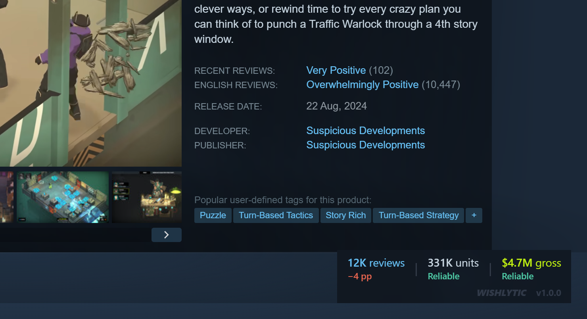
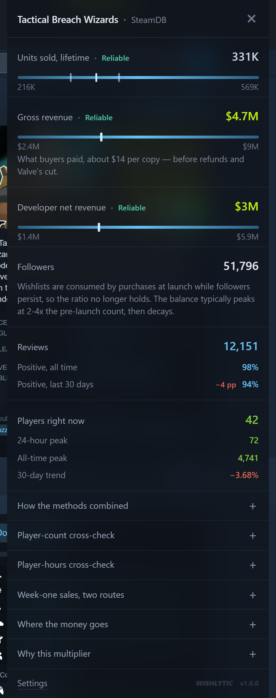
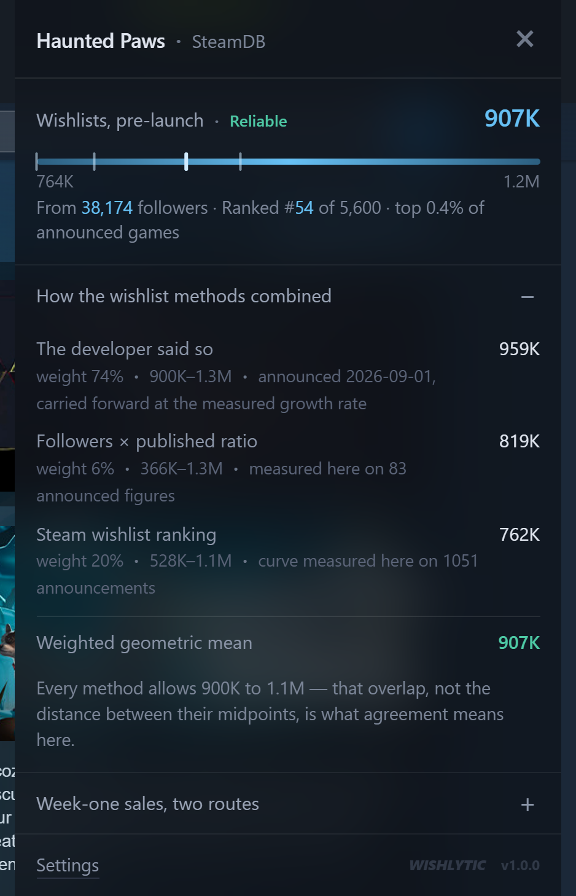
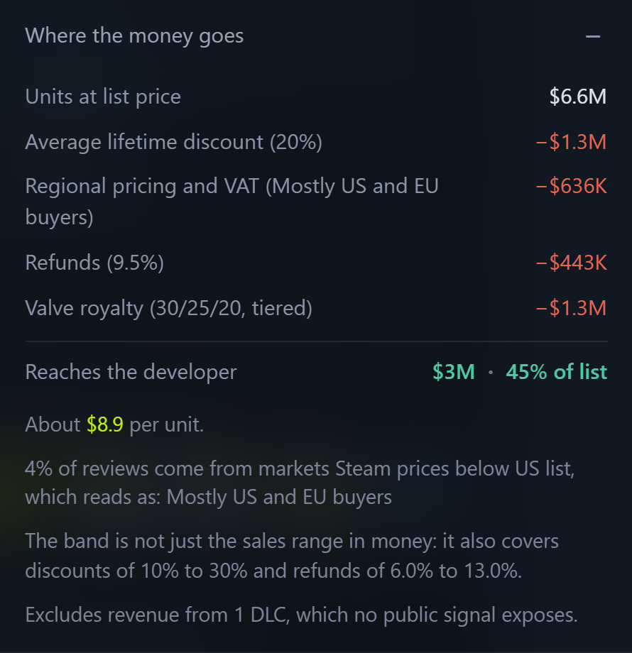

<h1 align="center">Wishlytic</h1>

<p align="center">
  <b>Units sold, developer revenue and wishlists, on any Steam store page.</b><br>
  Ranges, not single numbers — and every coefficient traceable to a published study.
</p>

<p align="center">
  
  
  
  
</p>



A pill in the corner of the page carries the figures at a glance. Click it and the panel says where each number came from, how far apart the methods behind it landed, and what it is worth.

## On screen

<table>
<tr>
<td width="50%" valign="top">

**A released game.** Units and both money figures, each on a scale marked with its low and high end, and a tick where every contributing method landed. Underneath, the measured inputs they were derived from — and the follower count, with the reason no wishlist number is offered after release.



</td>
<td width="50%" valign="top">

**An unreleased game.** Three independent marks — a figure the studio published, the game's place in Steam's wishlist ordering, its follower count — with the weight each earned and the overlap they leave. Agreement here means a common figure, not close midpoints.



</td>
</tr>
</table>

<p align="center"></p>

<p align="center"><b>Where the money goes.</b> Every deduction between the sticker price and the developer's bank account, named and sized.<br><sub>Screenshots show live figures for the games named in them, September 2026.</sub></p>

## Why another one of these

There are several free Steam revenue extensions. They share three problems:

1. **A single number.** The underlying multiplier spans 20x to 55x for a modern release. Presenting one figure hides a 2.75x spread that the reader then treats as a fact.
2. **A flat 30% for "net revenue".** Valve's cut is tiered (30/25/20) and is charged on adjusted gross — after VAT, refunds and chargebacks — not on the sticker price. Skipping regional pricing and discounts on top of that inflates the result by roughly 60%.
3. **No published accuracy.** None of them says how often it is right, so neither do their users.

This one takes the opposite position on all three.

## What it does

| Metric | Method | Availability |
| --- | --- | --- |
| Units sold, lifetime | Weighted ensemble of an adjusted review multiplier and the SteamSpy owner band | Released games with 10+ reviews |
| Gross and developer net revenue | Full waterfall: discount → regional pricing and VAT → refunds → tiered royalty | Paid games |
| Wishlists, pre-launch | Three marks, each weighted by the width of its own band: a figure the developer published, carried forward at the measured growth rate; the game's place in Steam's wishlist ordering, read through a curve fitted to those figures; followers × 9.6–32.8 | Unreleased games with any of a follower count, a ranked position or a published figure |
| Week-one sales | Two published routes shown side by side, never averaged | Unreleased games |
| Player-count cross-check | All-time peak concurrent × 11.4, kept outside the average | Games whose peak was set at launch |
| Player-hours cross-check | Measured player-hours ÷ an assumed average playtime, kept outside the average | Games with a concurrent-player history |
| Local trend | Snapshots of your own visits, stored on this device only | After two visits |

Every figure comes with a scale showing the low and high end. The width of that bar is the point.

## Honest limits

- **The ceiling sits in the middle of the published table, not at the top.** Benchmarks put a flat review multiplier at 42.7% of games within 30% error, adjusted multipliers at 50.4%, concurrent players over playtime at 64.4%, and a full ensemble at 76.9%. Two legs of that ensemble need infrastructure a browser extension does not have — continuous sampling of millions of Steam profiles, and years of daily top-seller snapshots — and a third is only half reachable, since the average playtime its exact player-hours must be divided by is published nowhere. Two estimators enter the average here. → [The accuracy ceiling](docs/METHODOLOGY.md#the-accuracy-ceiling)
- **Disagreement is never averaged away.** When no figure satisfies every method, the band expands to cover all of them and the confidence drops. A tidy midpoint between sources that exclude each other is worse than no answer.
- **Confidence scores the evidence, not the width of the bar** — how many independent methods agree, whether anything contradicts them, and whether the game is the size the sources were measured on. On units it is not yet a *prediction* of accuracy: across the 62 disclosed-sales fixtures the grades separate in the right direction but not significantly, and `npm run calibrate` prints those tables rather than a claim. → [Confidence](docs/METHODOLOGY.md#confidence)
- **Wishlists are the softest number here.** Steam publishes no counts for anyone. One mark is a fact about the game — a figure its own studio posted — and it exists for about one ranked game in nine; the other two are inference. Held out of its own fit, the model's median error is 12.3% on a figure posted in the last month and 21.9% on one of any age. After release the estimate is withheld entirely: wishlists are consumed by purchases while followers persist, and no stable ratio survives that. → [Wishlists](docs/METHODOLOGY.md#wishlists)
- **Under ten reviews, and on anything that is not a base game, there is no number.** Ten is where Steam itself starts scoring a game; below it one more review moves the answer by a tenth. DLC, soundtracks, videos and hardware are each declined with their own reason rather than a blanket "unsupported" — and a demo, which Steam links to its parent game, shows that game's figures and says so. → [Gates and refusals](docs/METHODOLOGY.md#gates-and-refusals)

## Install

Not on the Chrome Web Store yet: the release is gated on publishing an accuracy figure. Shipping an uncalibrated estimator is how the existing tools ended up with reviews saying they underestimate by two to three times.

```bash
git clone https://github.com/q-sn/steam-revenue-wishlist-estimator.git
```

Open `chrome://extensions/`, enable Developer mode, click **Load unpacked** and select the folder. Then visit any `store.steampowered.com/app/…` page. No build step, no bundler, no dependencies.

## Privacy

No account, no telemetry, no analytics, and no network calls to anything but Steam, SteamSpy and SteamCharts. Every request sets `credentials: 'omit'`, so your Steam cookies are never attached to one. Visit snapshots and cached lookups live in `chrome.storage.local`, on your device only, and can be wiped from the options page. The whole of what it touches is in [PRIVACY.md](PRIVACY.md).

## Languages

English, Russian, Simplified Chinese, Spanish, Brazilian Portuguese, German, French, Japanese, Korean, Turkish, Polish and Italian. The extension follows your browser's UI language, and numbers are formatted with `Intl` so they read naturally in each one. Translations live in one master table, `tools/locales.source.json`, and `node tools/build-locales.mjs` regenerates `_locales/` — refusing to run if a locale is missing a key or if a translation dropped a `$1` placeholder, which is how a number silently disappears from a sentence.

## Development

```bash
npm run smoke        # offline checks, run before every commit
npm run calibrate    # grade the estimator on 62 games with disclosed sales
npm run check:model  # refit the wishlist model from the archive
npm run locales      # rebuild _locales/ from the master table
npm run zip          # the store upload, refusing to build what would be rejected
```

`src/core/` holds the estimators and touches no browser API, which is what lets the calibration harness test the exact code that ships rather than a reimplementation of it that drifts. `check:model` exits non-zero when a constant stops reproducing from the archive, so a drifting fit fails instead of passing quietly. The wishlist-ranking jobs (`ranks`, `anchors`, `condense`, `check:ratio`) run in CI; `data/` is where they write locally and is git-ignored, and the published files live on the `data` branch.

`test/fixtures.json` holds 62 games whose developers published real unit counts, each with the review count and positive share of its announcement day frozen in. **More games are the single most valuable contribution to this project** — the set is thin below a thousand copies and thinner still before 2020.

## Contributing

One rule above the others: **no coefficient without a source.** `src/core/constants.js` pairs every number with the study it came from and marks the ones whose *size* is our own judgement rather than a published figure. A number you cannot cite does not belong in a tool that claims to be honest about its uncertainty, and a number that looks cited when it is not is worse.

Full guidelines in [CONTRIBUTING.md](CONTRIBUTING.md). Every formula and what it is worth is in [docs/METHODOLOGY.md](docs/METHODOLOGY.md).

## Credits

The coefficients here are other people's research. Jake Birkett, Simon Carless at GameDiscoverCo, Karl Kontus at Video Game Insights, and the Gamalytic team all published the studies this tool depends on, and all of them published their limitations too. Full citations with links are in `src/core/constants.js`.

Not affiliated with Valve. Steam is a trademark of Valve Corporation.

## Licence

MIT
